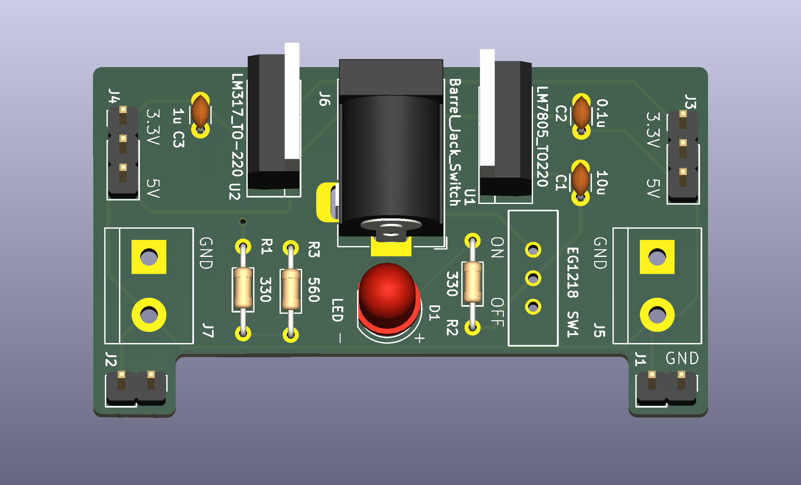
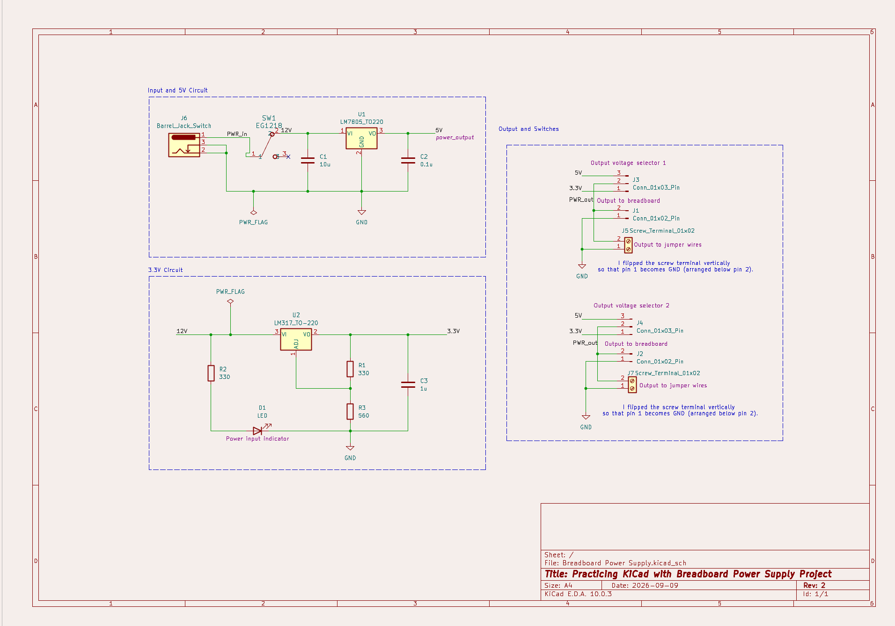

## Project Overview
This project is an open-source, dual-rail breadboard power supply designed to plug directly into standard MB-102 breadboard power buses. Powered via a standard $7\text{V} - 12\text{V}$ DC barrel jack, it generates independent $3.3\text{V}$ and $5.0\text{V}$ linear-regulated rails to safely power microcontrollers, sensors, and prototype circuits.

| 3D PCB Render | Schematic Diagram |
| :---: | :---: |
|  |  |

---

## Technical Specifications
* **Input Voltage:** $7\text{V} - 12\text{V}$ DC via $2.1\text{ mm} \times 5.5\text{ mm}$ Barrel Jack (`J6`)
* **Regulated Output Rails:** Dual selectable $3.3\text{V}$ and $5.0\text{V}$ outputs
* **Max Output Current:** Up to $800\text{mA}$ total (thermally limited)
* **Master Power Control:** Onboard SPDT slide switch (`SW1`) with power status LED (`D1`)
* **Output Selectors:** 3-pin headers (`J3` & `J4`) with physical jumper shunts to independently assign $3.3\text{V}$ or $5.0\text{V}$ to each breadboard rail
* **Auxiliary Outputs:** 2-pin screw terminals (`J5` & `J7`) wired in parallel for multimeter leads or external wiring
* **Form Factor:** Standard $2.54\text{ mm}$ pitch headers for MB-102 breadboard dual-bus alignment
  
## KiCad Layout & Hardware Design Highlights
* **Ground Plane Pour:** Large top and bottom copper pours (`F.Cu` and `B.Cu`) act as a solid ground reference and help dissipate thermal energy generated by the linear regulators.
* **Filter & Decoupling Capacitors:** Bulk $10\ \mu\text{F}$ input capacitance suppresses low-frequency DC ripple, while dedicated $0.1\ \mu\text{F}$ and $1\ \mu\text{F}$ ceramic capacitors placed close to regulator outputs eliminate high-frequency noise and voltage dip transients.
* **LM317 Voltage Setting:** Configured with a precision resistor feedback divider ($R_1 = 330\ \Omega$, $R_3 = 560\ \Omega$) to yield a stable $3.37\text{ V}$ nominal rail.
* **Thermal Reliefs & Manufacturing Rules:** Applied spoke thermal reliefs on ground pads for smooth hand-soldering. Fully DRC-verified against standard $6\text{ mil}$ clearance and trace width rules for instant fabrication via JLCPCB or PCBWay.

## Project Origin & Attribution
I designed this as a practical portfolio project following the structured learning modules in "PCB Design with KiCad" by Dr. Peter Dalmaris. I independently executed all schematic capture, PCB routing, ground pour strategy, DRC verification, and fabrication output generation in KiCad 10.

## Repository Organization
```text
├── README.md                 # Project overview & design documentation
├── .gitignore                # KiCad temporary & cache file filters
├── docs/                     # Visual assets (3D renders, schematic PDF)
├── hardware/                 # KiCad 10 source files (.kicad_sch, .kicad_pcb)
└── production/               # Fabrication deliverables
    ├── gerbers/               # Zipped Gerber manufacturing archive (.zip)
    ├── bom/                  # Component lists (CSV & Interactive HTML BOM)
    └── assembly/             # Pick-and-place files (.pos / pdf)
